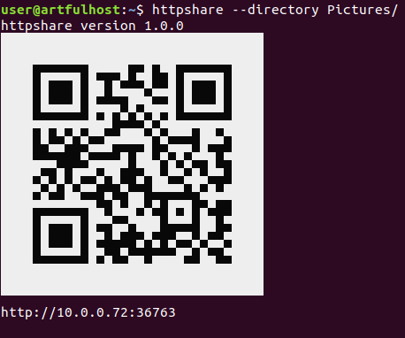
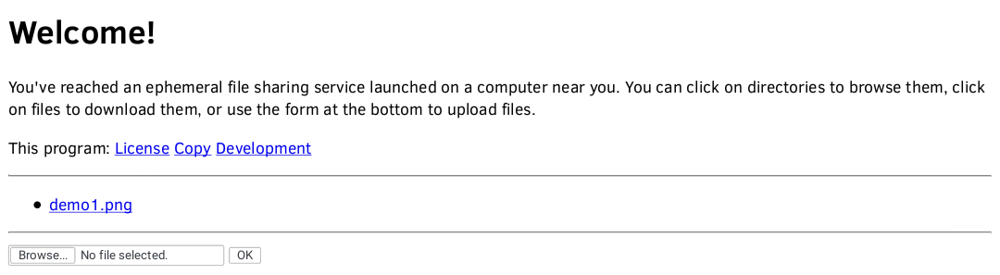

What's this?
============

An easy-to-deploy file transfer tool.  The only requirements are:

* both devices must be connected on the same local network,

* One has a Python interpreter,

* The other has a web browser.

Usage
=====
Make sure you have a Python interpreter set up.
It doesn't matter if it's 2.7 or 3+.
Then, head to the releases_ page and pick the most recent.
(Or see Distribution_ for more alternatives.)
Finally, run it in a terminal.
It doesn't need setup or unpacking, it's a self-contained `Python ZIP application`_.

When launched, unless a network address was specified on the command-line, httpshare learns its address by connecting to a widely available web site. (http://github.com/)
This is reasonably likely to be the correct setting in common scenarios since most networks nowadays are primarily meant to provide access to the internet.
Once this is done, it starts listening on an ephemeral port and prints an URL to help the other device (*the guest*) connect.
The URL is supplemented by an equivalent QR code.
Once it connects, the guest can control httpshare by interacting with the web pages that it serves.
This enables file transfer in both directions.
When the guest performs a file upload, manual confirmation will be required on the host.

.. _releases: https://github.com/bbjubjub2494/httpshare/releases
.. _Python ZIP application: https://docs.python.org/3/library/zipapp.html#the-python-zip-application-archive-format

Limitations
===========
httpshare is not designed to protect any data against a hostile third party accessing the same local network.
It's perfectly possible that such an attacker could copy or alter the contents of the files being exchanged.
If available, use more robust file-sharing methods.
Also consider encrypting and/or authenticating data using separate tools.
Using httpshare ideally shouldn't open the host to remote code execution, but no formal guarantee is made.

httpshare is single-threaded and uses synchronous IO.
This renders it unable to serve multiple guests simultaneously.
However, it's possible to run multiple instances in parallel and assign one to each guest.

Distribution
============
As mentioned above, the httpshare ZIP application can be grabbed from the web.
It can also distribute itself through its ephemeral web site.
(Click "Copy".)
You can still use the PGP signature found at releases_ in this case.
Please follow this link to `the signing key`_.

A `PyPI variant`_ of this software is also available.
It cannot distribute itself.

.. _the signing key: release_key.asc
.. _PyPI variant: https://pypi.python.org/pypi/httpshare

Building
========
Building the ZIP application is achieved simply by running the ``make_zipapp.py`` script.
In theory, it should produce a result that's bit-identical to the one I publish.
This is corroborated by building each release on Travis CI as well as on my machine.
The goal is to have `build reproductibility`_.

httpshare is `free software`_, released under the zlib/libpng License.
If you intend to distribute derivative version of this software, I would encourage using the ``PREFIX`` field in ``version.py`` to mark them as such.

.. _build reproductibility: https://reproducible-builds.org/
.. _free software: http://www.gnu.org/philosophy/free-sw.html

Trivia
======
The Python standard library module ``http.server`` (or ``SimpleHTTPServer`` in Python 2) offers similar functionality, but doesn't support uploading.
This project started with the goal of enhancing it, although it doesn't rely on code that's part of it.
